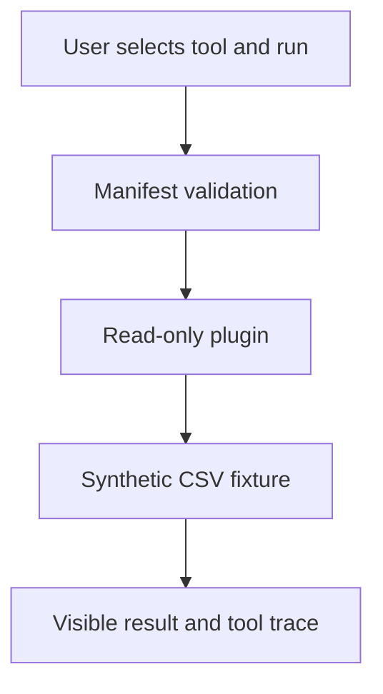

# Pipeline operations workbench

A small educational project exploring explicit tools and plugin manifests. It investigates synthetic pipeline runs through two read-only tools. It is **not** an autonomous AI agent: tool selection is made by the user, so the trace shows exactly what ran. An optional LLM router could be explored later without changing the tool contracts.

## Run locally

With Python 3.10+, from this directory:

```bash
python -m venv .venv
source .venv/bin/activate          # Windows PowerShell: .venv\Scripts\Activate.ps1
pip install -r requirements.txt
streamlit run app.py
```

Choose run `R-002`, execute **Inspect one synthetic pipeline run**, then **Show quality checks**. The sample reveals a failed load with five rejected rows and two failed checks. Run `python -m unittest discover -p 'test_*.py'` for the standard-library tests.

## How it works



Each `plugins/<name>/` directory has a `manifest.json` declaring a name, description, and input names, plus a `tool.py` exposing `run()`. The runner checks tool and argument names before calling a plugin. The bundled plugins read packaged sample data only. Plugins are Python code and must be trusted before installation; manifest validation alone does not sandbox arbitrary code.

## Explore further

Add a third read-only plugin for anomaly trends, or build a deterministic routing layer that selects one of the published tools from a structured request. An LLM-powered router would need an API key, tool-call limits, error handling, and clear disclosure of model-generated interpretations. No external API or model is required for this version.

This is an original learning exercise inspired by the plugin idea in [Pipegent](https://github.com/tathagata1/Pipegent); it does not reuse that repository's code.
