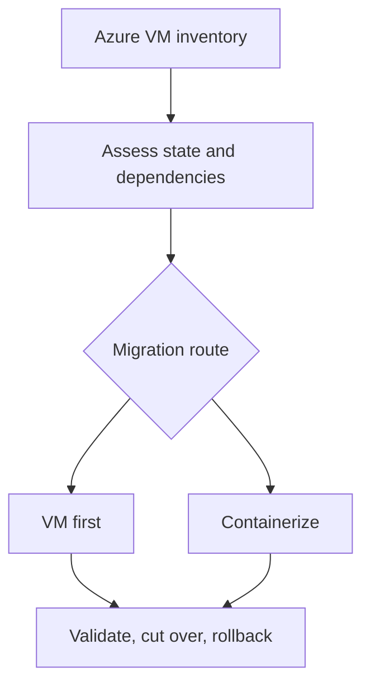

# Azure to GCP migration decision lab

An educational, local decision exercise for a **synthetic** application running on an Azure VM. Enter a small inventory, receive an explainable first-pass route and migration wave, then download a validation and rollback checklist. No cloud account, Terraform apply, or paid service is needed.

## Run

Use Python 3.10+ from this directory:

```bash
python -m venv .venv
source .venv/bin/activate            # Windows PowerShell: .venv\Scripts\Activate.ps1
pip install -r requirements.txt
streamlit run app.py
```

Run tests with `python -m unittest discover -p 'test_*.py'`. Try the defaults: a stateless service with a container build becomes a pilot candidate. Then enable local state and regulated data: the exercise proposes VM-first and a later wave.

## What the decision represents



| Phase | Exercise output | Cloud implementation to research separately |
|---|---|---|
| Assess | State, dependencies, volume and regulation | Discovery and dependency mapping |
| Plan | Pilot/later wave, identity/network/backup checks | Azure–GCP connectivity, IAM, address planning |
| Deploy | VM or container route | Compute Engine migration or container deployment |
| Optimize | Acceptance and rollback checks | Monitoring, sizing, cost, hardening |

The rule engine is intentionally small and inspectable. A real assessment needs measured usage, licensing, OS support, network throughput, application ownership, regulatory review, and a tested recovery plan. The tool does **not** perform a migration or prove compatibility. Windows and Linux are inventory fields; the current rules do not treat them differently.

## Study provenance

Inspired by the user's Google Cloud training notes on VM planning, migration to Compute Engine, container migration, and incremental monolith decomposition. This project uses an original synthetic scenario and implementation, not the lab text, temporary credentials, or obsolete step-by-step cloud commands. The staged service separation in the monolith lesson informs the container route; it is not implemented as a Kubernetes deployment here.

## Interview walkthrough

Explain why local state favors a conservative first step, why a pilot should have few dependencies, how Azure and GCP identities remain separate, and which checks trigger rollback. Challenge the simple rules with a counterexample and describe what evidence you would collect before an actual cutover.
