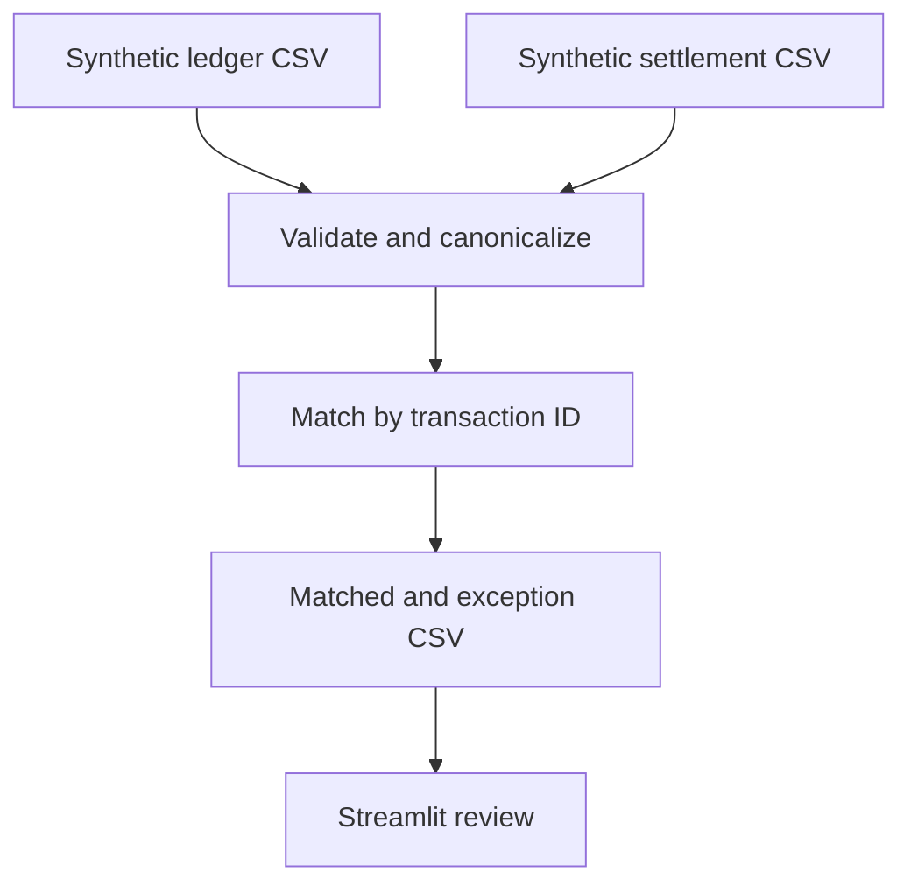

# Finance reconciliation lab

An educational, locally runnable example of a finance data pipeline. Two synthetic CSV feeds represent a transaction ledger and a payment settlement. The program validates keys and amounts, matches by transaction ID, and produces an exception report. It does not connect to a bank or a GCP account.

## Run in 10 minutes

From this directory, use Python 3.10+:

```bash
python -m venv .venv
source .venv/bin/activate            # Windows PowerShell: .venv\Scripts\Activate.ps1
pip install -r requirements.txt
streamlit run app.py
```

Click **Run reconciliation** to use the included samples, or upload two CSV files with `transaction_id,amount,currency` columns. Download the result as CSV. Run the standard-library tests with `python -m unittest discover -p 'test_*.py'`.

## Expected result

`TX-100` matches. `TX-101` differs in amount; `TX-102` differs in currency; `TX-103` appears only in the ledger; `TX-104` appears only in settlement. No transactions use real customer data.

## Architecture and GCP mapping



| Local component | Possible GCP implementation (design only) |
|---|---|
| CSV upload | Cloud Storage landing bucket, controlled ingestion |
| Validation | Cloud Run job and quarantine bucket |
| Reconciliation | BigQuery SQL/dbt models keyed by transaction ID |
| Review | Looker Studio exception dashboard |
| Scheduling | Cloud Composer DAG or Workflows |

The local program is the implemented artifact. The GCP mapping is an interview discussion guide; no GCP deployment or production performance is claimed.

## Design decisions and boundaries

- Decimal arithmetic prevents binary floating-point rounding in financial amounts.
- Duplicate IDs within a feed are rejected instead of silently overwriting records.
- Currency differences are exceptions; this exercise does not perform FX conversion.
- Matching is one-to-one on transaction ID. Real reconciliation also needs settlement batches, fees, refunds, time windows, late arrivals, idempotency, and audit controls.
- Uploaded files are processed in memory. Run locally with synthetic data; no authentication or persistent storage is provided.

## Interview walkthrough

Explain the five sample outcomes, then discuss how you would handle duplicate settlement IDs, delayed files, source lineage, access control, and an operator-approved correction. Show the tests and separate the local implementation from the GCP reference design.
